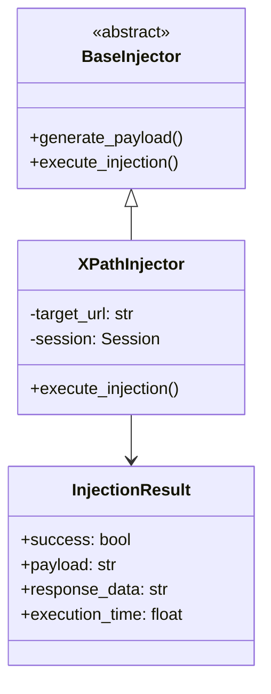

# 🐍 XPath Injection Framework

[](https://www.python.org/downloads/)
[](LICENSE)
[](https://github.com/psf/black)
[](https://github.com/PyCQA/bandit)

Продвинутый фреймворк для тестирования XPath-инъекций с использованием современных подходов ООП Python.

## 📋 Содержание

- [Особенности](#особенности)
- [Установка](#установка)
- [Использование](#использование)
- [Архитектура](#архитектура)
- [API Reference](#api-reference)
- [Примеры](#примеры)
- [Участие в разработке](#участие-в-разработке)
- [Лицензия](#лицензия)

## ✨ Особенности

- 🛡️ Различные типы XPath-инъекций
- 📊 Подробная система отчетности
- 🔄 Автоматический retry механизм
- 📝 Расширенное логирование
- ⚡ Измерение производительности
- 🔌 Расширяемая архитектура

## 🚀 Установка

```bash
# Клонирование репозитория
git clone https://github.com/Kaneki-hash/Xpath-Injection-Parser.git

# Установка зависимостей
pip install -r requirements.txt
```

## 💻 Использование

### Базовый пример

```python
from xpath_injector import XPathInjector, AutomatedInjector

# Создание инжектора
injector = XPathInjector("http://target-site.com/login")

# Создание автоматизированного тестировщика
automated = AutomatedInjector(injector)

# Запуск кампании
automated.run_campaign()

# Получение отчета
report = automated.generate_report()
```

### Расширенный пример

```python
from xpath_injector import XPathInjector, InjectionType, PayloadGenerator

class CustomPayloadGenerator(PayloadGenerator):
    def generate(self) -> List[str]:
        return [
            "custom_payload_1",
            "custom_payload_2"
        ]

injector = XPathInjector("http://target-site.com/login")
injector.payload_generators[InjectionType.CUSTOM] = CustomPayloadGenerator()
```

## 🏗️ Архитектура

### Диаграмма классов



## 📚 API Reference

### XPathInjector

```python
class XPathInjector(BaseInjector, LoggingMixin, TimingMixin):
    """
    Основной класс для выполнения XPath-инъекций.
    
    Attributes:
        target_url (str): URL целевого сайта
        session (requests.Session): Сессия для HTTP-запросов
        successful_payloads (List[InjectionResult]): Успешные инъекции
    """
```

Или просто run_injector.py

[Полная документация по API](docs/API.md)

## 📝 Примеры

### Тестирование аутентификации

```python
injector = XPathInjector("http://target-site.com/login")
result = injector.execute_injection("' or '1'='1")

if result.success:
    print(f"Уязвимость найдена! Время выполнения: {result.execution_time}")
```

[Больше примеров](docs/examples/)

## 🤝 Участие в разработке

Мы приветствуем вклад в развитие проекта! Вот как вы можете помочь:

1. Fork репозитория
2. Создайте ветку для новой функциональности
   ```bash
   git checkout -b feature/amazing-feature
   ```
3. Commit изменения
   ```bash
   git commit -m 'Add amazing feature'
   ```
4. Push в ветку
   ```bash
   git push origin feature/amazing-feature
   ```
5. Создайте Pull Request

## 📄 Лицензия

Распространяется под лицензией MIT. Смотрите [LICENSE](LICENSE) для деталей.

## ⚠️ Отказ от ответственности

Этот инструмент предназначен только для образовательных целей и тестирования собственных систем. Использование против чужих систем без разрешения является незаконным.

## 📦 requirements.txt

```
requests>=2.26.0
typing-extensions>=4.0.0
python-dateutil>=2.8.2
logging>=0.5.1.2
```
