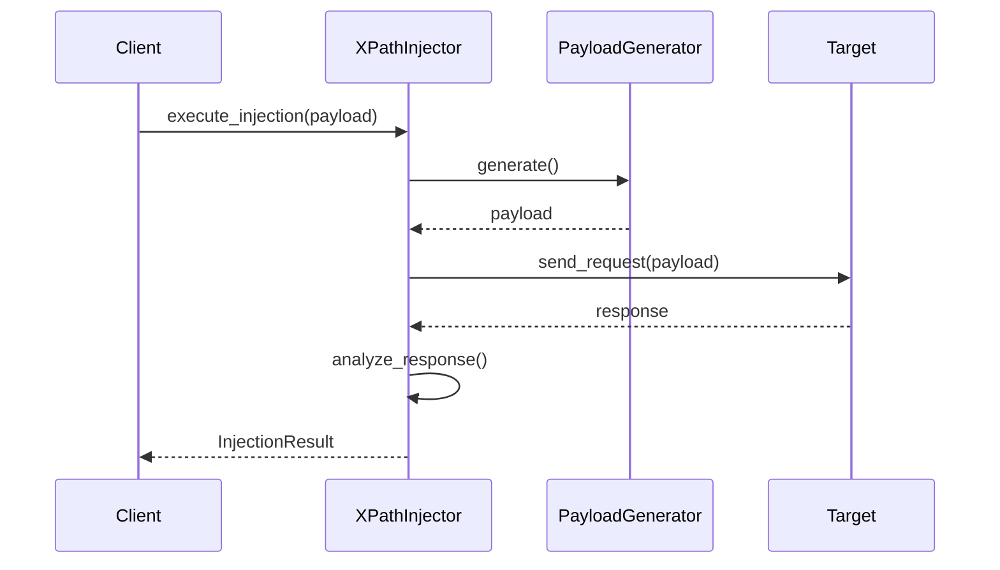

# 📚 XPath Injection Framework API Reference

## 📋 Содержание
- [Core Classes](#core-classes)
- [Models](#models)
- [Utilities](#utilities)
- [Exceptions](#exceptions)
- [Configuration](#configuration)

## 🎯 Core Classes

### XPathInjector

```python
class XPathInjector(BaseInjector, LoggingMixin, TimingMixin):
    """
    Основной класс для выполнения XPath-инъекций.
    """
    
    def __init__(self, target_url: str, settings: Optional[Settings] = None):
        """
        Инициализация инжектора.

        Args:
            target_url (str): URL целевого сайта
            settings (Optional[Settings]): Настройки инжектора
        """
        
    def execute_injection(self, payload: str) -> InjectionResult:
        """
        Выполнение XPath-инъекции.

        Args:
            payload (str): Payload для инъекции

        Returns:
            InjectionResult: Результат выполнения инъекции

        Raises:
            InjectionExecutionError: При ошибке выполнения
        """
        
    @retry_on_failure(max_attempts=3)
    def _send_request(self, payload: str) -> requests.Response:
        """
        Отправка HTTP-запроса с payload.

        Args:
            payload (str): Payload для инъекции

        Returns:
            requests.Response: Ответ сервера
        """
```

### AutomatedInjector

```python
class AutomatedInjector:
    """
    Класс для автоматизированного тестирования инъекций.
    """
    
    def run_campaign(self) -> None:
        """
        Запуск кампании тестирования.
        """
        
    def generate_report(self) -> Dict[str, Any]:
        """
        Генерация отчета о результатах тестирования.

        Returns:
            Dict[str, Any]: Отчет о результатах
        """
```

## 📊 Models

### InjectionResult

```python
@dataclass
class InjectionResult(BaseModel):
    """
    Результат выполнения инъекции.
    """
    success: bool
    payload: str
    response_data: Optional[str]
    execution_time: float
    vulnerability_type: InjectionType
```

### InjectionType

```python
class InjectionType(Enum):
    """
    Типы XPath-инъекций.
    """
    AUTHENTICATION = "auth"
    DATA_EXTRACTION = "data"
    ERROR_BASED = "error"
    BLIND = "blind"
```

## 🛠 Utilities

### Decorators

```python
def retry_on_failure(max_attempts: int = 3, delay: float = 1.0):
    """
    Декоратор для повторных попыток выполнения при ошибке.

    Args:
        max_attempts (int): Максимальное количество попыток
        delay (float): Задержка между попытками в секундах
    """

def measure_execution_time(func):
    """
    Декоратор для измерения времени выполнения функции.
    """
```

### Mixins

```python
class LoggingMixin:
    """
    Миксин для логирования операций.
    """
    def log_injection_attempt(self, payload: str, result: bool):
        """
        Логирование попытки инъекции.

        Args:
            payload (str): Использованный payload
            result (bool): Результат выполнения
        """

class TimingMixin:
    """
    Миксин для измерения времени выполнения.
    """
```

## ⚠️ Exceptions

```python
class InjectionException(Exception):
    """Базовое исключение фреймворка."""
    pass

class PayloadGenerationError(InjectionException):
    """Ошибка генерации payload."""
    pass

class InjectionExecutionError(InjectionException):
    """Ошибка выполнения инъекции."""
    pass
```

## ⚙️ Configuration

### Settings

```python
@dataclass
class Settings:
    """
    Настройки фреймворка.
    """
    timeout: int = 30
    max_retries: int = 3
    proxy: Optional[str] = None
    verify_ssl: bool = True
    user_agent: str = "XPath-Injection-Framework/1.0"
```

## 📝 Примеры использования

### Базовое использование

```python
from xpath_injector import XPathInjector
from xpath_injector.config import Settings

# Создание инжектора
settings = Settings(timeout=60)
injector = XPathInjector("http://target.com/login", settings=settings)

# Выполнение инъекции
result = injector.execute_injection("' or '1'='1")

if result.success:
    print(f"Уязвимость найдена! Время выполнения: {result.execution_time}")
```

### Автоматизированное тестирование

```python
from xpath_injector import AutomatedInjector, XPathInjector

# Инициализация
injector = XPathInjector("http://target.com/login")
automated = AutomatedInjector(injector)

# Запуск кампании
automated.run_campaign()

# Получение отчета
report = automated.generate_report()
print(f"Успешных атак: {report['successful_attempts']}")
```

## 🔄 Жизненный цикл инъекции



## 📦 Типы данных

| Тип | Описание | Пример |
|-----|----------|--------|
| `str` | Строка | `"' or '1'='1"` |
| `bool` | Булево значение | `True/False` |
| `float` | Время выполнения | `0.234` |
| `InjectionType` | Тип инъекции | `InjectionType.AUTHENTICATION` |
| `Dict[str, Any]` | Отчет | `{"success": True, ...}` |

## 🔒 Безопасность

При использовании фреймворка следует учитывать:

- Тестируйте только системы, на которые у вас есть разрешение
- Используйте безопасное соединение (HTTPS)
- Не сохраняйте чувствительные данные в логах
- Соблюдайте политику безопасности целевой системы

## 🔍 Отладка

Для включения подробного логирования:

```python
import logging
logging.basicConfig(level=logging.DEBUG)
```

## 📈 Производительность

Рекомендации по оптимизации:

- Используйте асинхронные запросы для массового тестирования
- Настройте таймауты в соответствии с целевой системой
- Используйте кэширование результатов
- Оптимизируйте генерацию payload'ов

---
